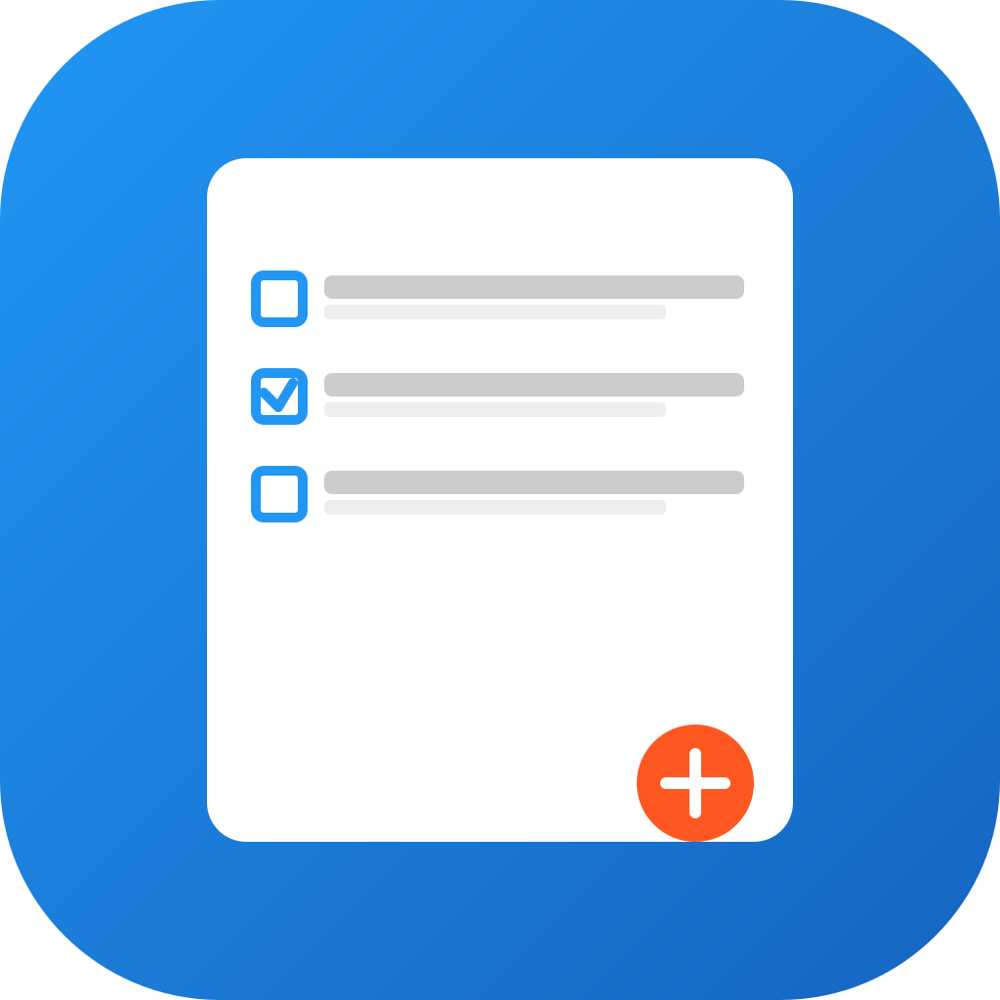

# QuickTask

<div align="center">



A modern Flutter task management application designed with clean architecture and advanced state management techniques.

[](https://bloclibrary.dev/)
[](https://firebase.google.com/products/firestore)
[](https://docs.hivedb.dev/)
[](https://blog.cleancoder.com/uncle-bob/2012/08/13/the-clean-architecture.html)

<!-- Architecture Diagrams -->
<p align="center">
  
</p>

<!-- Technology Stack Visual -->
<p align="center">
  
  <br>
  
  
</p>

</div>

## Overview

QuickTask is a powerful yet intuitive task management application built exclusively for Android and iOS mobile platforms using Flutter. It helps users organize their tasks with features like priority levels, due dates, and reminders. The application follows clean architecture principles and implements advanced patterns like BLoC for state management, with a focus on delivering a smooth mobile-first experience.

## Key Features

- **Task Management**: Create, update, view, and delete tasks
- **Task Organization**: Categorize tasks by completion status and priority
- **Due Dates**: Set and track task deadlines
- **Reminders**: Get notified before tasks are due
- **Offline Support**: Access and modify tasks even without an internet connection
- **Mobile-Focused**: Designed exclusively for Android and iOS devices

## Technical Architecture

### Clean Architecture

The project is organized following Clean Architecture principles with three main layers:

1. **Domain Layer**
    - Business logic and rules
    - Platform-independent entities
    - Abstract repositories
    - Use cases that encapsulate application-specific business rules

2. **Data Layer**
    - Implementations of repositories from the domain layer
    - Data sources (local and remote)
    - Models (data objects)
    - Mappers between entities and models

3. **Presentation Layer**
    - UI components
    - BLoC (Business Logic Components) for state management
    - Screens and widgets

### State Management with BLoC

The application implements the BLoC (Business Logic Component) pattern for state management:

- **Events**: User actions or system events that trigger state changes
- **States**: Immutable objects representing the application's state at a given point
- **Blocs**: Components that convert events to states

This separation provides a clear and predictable state management flow, making the application easier to test and maintain.

### Storage Solutions

#### Cloud Firestore (Remote Storage)

- Real-time data synchronization across devices
- Secure database with offline capabilities
- Document-based NoSQL database structure

#### Hive (Local Storage)

- Fast, lightweight NoSQL database
- Complete offline support
- Type adapters for efficient serialization/deserialization
- Minimal setup with no native dependencies

### Dependencies and Services

#### Service Locator (get_it)

- Dependency injection for cleaner code
- Flexible service locator pattern
- Lazy initialization of services and repositories

#### Local Notifications

- Task reminders using Flutter Local Notifications
- Platform-specific notifications for both Android and iOS
- Scheduled notifications for upcoming tasks
- Proper Android manifest configuration for notifications permissions
- Background notification delivery even after app restart

#### Device Information

- Device-specific identification
- Platform-aware adaptations
- User identification via device ID

## Project Structure

```
lib/
├── core/              # Core functionality
│   ├── constants/     # App-wide constants
│   ├── di/            # Dependency injection
│   ├── router/        # Navigation/routing
│   ├── themes/        # App theming
│   └── utils/         # Utility functions
├── data/              # Data layer
│   ├── datasources/   # Data providers
│   │   ├── local/     # Local storage 
│   │   └── remote/    # Remote APIs
│   ├── models/        # Data models
│   └── repositories/  # Repository implementations
├── domain/            # Domain layer
│   ├── entities/      # Business entities
│   ├── repositories/  # Repository interfaces
│   └── usecases/      # Business logic
├── presentation/      # Presentation layer
│   ├── blocs/         # BLoC state management
│   ├── screens/       # UI screens
│   └── widgets/       # Reusable UI components
└── services/          # Additional services
```

## Technical Details

- **Flutter**: 3.27.0 (Stable Channel)
- **Dart**: 3.7.0
- **State Management**: flutter_bloc (BLoC pattern)
- **Dependency Injection**: get_it
- **Navigation**: go_router
- **Remote Database**: cloud_firestore
- **Local Database**: hive, hive_flutter
- **Device Information**: device_info_plus
- **Notifications**: flutter_local_notifications (v19.1.0)
    - API changes: Removed `uiLocalNotificationDateInterpretation` parameter
    - Added background notification handling
- **Time Handling**: timezone (v0.10.0)

## Mobile Platform Configuration

### Android Notification Configuration

The app is configured with proper permission handling for notifications on Android:

```xml
<!-- Required for scheduling notifications -->
<uses-permission android:name="android.permission.RECEIVE_BOOT_COMPLETED"/>
<uses-permission android:name="android.permission.POST_NOTIFICATIONS"/>
<uses-permission android:name="android.permission.VIBRATE"/>
    
<!-- For exact alarms (scheduled notifications with exact timing) -->
<uses-permission android:name="android.permission.SCHEDULE_EXACT_ALARM" />
<!-- Alternative permission for Android 13+ that doesn't require user prompt but requires approval -->
<!-- <uses-permission android:name="android.permission.USE_EXACT_ALARM" /> -->
```

### Handling Permission Denial

The app gracefully handles cases where users deny notification permissions:

1. When creating or updating a task with reminders, the app first checks for required permissions
2. If permissions are not granted, the app attempts to request them from the user
3. If the user denies permissions, the app continues to function normally but:
    - The task is still created/updated in the database
    - The user is informed that reminders won't be shown via a special permission denied state
    - The app's state management system (BLoC) emits special states to handle this case

This approach ensures the app remains functional even when users choose to deny notification permissions.

### Cross-Platform Permission Handling

The app handles permissions differently based on the platform:

- **Android**: Uses `areNotificationsEnabled()` to check and handles exact alarm permissions with `requestExactAlarmsPermission()`
- **iOS**: Uses `requestPermissions()` with appropriate settings for alerts, badges, and sounds

All platform-specific code is wrapped in try-catch blocks to ensure the app doesn't crash if a method isn't available on a particular platform version or if unexpected errors occur.

To comply with Android 14's behavior changes, the app requests exact alarm permissions at runtime:

```dart
// Request exact alarm permissions for Android 14+
try {
  await android.requestExactAlarmsPermission();
} catch (e) {
  print('Error requesting exact alarms permission: $e');
  // Continue anyway as this might not be supported on all Android versions
}
```

The app also supports background notification handling with a top-level function:

```dart
// Top-level function for handling notification background actions
@pragma('vm:entry-point')
void notificationTapBackground(NotificationResponse notificationResponse) {
  // Handle notification background tap
  print('BACKGROUND notification tap: ${notificationResponse.payload}');
}
```

Additional receivers are configured to handle scheduled notifications, boot completion, and notification actions:

```xml
<!-- Receivers for scheduled notifications -->
<receiver android:exported="false" 
          android:name="com.dexterous.flutterlocalnotifications.ScheduledNotificationReceiver" />
<receiver android:exported="false" 
          android:name="com.dexterous.flutterlocalnotifications.ScheduledNotificationBootReceiver">
    <intent-filter>
        <action android:name="android.intent.action.BOOT_COMPLETED"/>
        <action android:name="android.intent.action.MY_PACKAGE_REPLACED"/>
        <action android:name="android.intent.action.QUICKBOOT_POWERON" />
        <action android:name="com.htc.intent.action.QUICKBOOT_POWERON"/>
    </intent-filter>
</receiver>
    
<!-- Receiver for notification actions -->
<receiver android:exported="false" 
          android:name="com.dexterous.flutterlocalnotifications.ActionBroadcastReceiver" />
```

### iOS Notification Configuration

For iOS, the app requests the following permissions in `Info.plist`:

```xml
<key>UIBackgroundModes</key>
<array>
   <string>fetch</string>
   <string>remote-notification</string>
</array>
```

And programmatically requests permissions using the `DarwinInitializationSettings`:

```dart
// Initialize notification settings for iOS
const iosInitSettings = DarwinInitializationSettings(
  requestAlertPermission: true,
  requestBadgePermission: true,
  requestSoundPermission: true,
);

// Request permissions for iOS
final ios = _notificationsPlugin.resolvePlatformSpecificImplementation<
    IOSFlutterLocalNotificationsPlugin>();
if (ios != null) {
  await ios.requestPermissions(
    alert: true,
    badge: true,
    sound: true,
  );
}
```

## Architecture Flow

1. **User Interaction**: User interacts with the UI (presentation layer)
2. **Event Creation**: UI creates an event and dispatches it to a BLoC
3. **Use Case Execution**: BLoC delegates to appropriate use case in the domain layer
4. **Repository Access**: Use case calls repository methods
5. **Data Source Selection**: Repository decides between local and remote data sources
6. **State Update**: BLoC emits new state based on repository response
7. **UI Rendering**: UI rebuilds based on the new state

## Project Status and Implementation

The QuickTask app has been implemented with the following features:

- **Clean Architecture**: The complete app architecture with domain, data, and presentation layers
- **Data Storage**: Dual storage with Cloud Firestore for remote and Hive for local caching
- **State Management**: BLoC pattern implementation for managing application state
- **User Interface**: Fully designed screens for task management (home, detail, add/edit)
- **Cross-Device Identity**: Device ID-based user identification without login/signup
- **Task Reminders**: Local notifications for upcoming tasks on both Android and iOS
- **Platform Configuration**: Complete manifest and permission setup for Android and iOS


QuickTask uses custom designed icons that reflect the app's focus on organization and task management:

- **App Icon**: The main app icon features a task list with checkboxes on a blue gradient background
- **Adaptive Icons**: For modern Android devices, adaptive icons are used with a white background and the task list as the foreground
- **In-App Icons**: SVG-based icons are used within the app for consistent scaling across all device densities

The app icons were created as SVG files and converted to PNG format for various device densities using ImageMagick and librsvg tools.

## Privacy and Terms


### Build Process

To run or build the app locally:

```bash
# Get dependencies
flutter pub get

# Run in debug mode
flutter run

# Build release APK
flutter build apk --release

# Build app bundle for Play Store
flutter build appbundle --release
```

---

<div align="center">
  <p>
    <strong>QuickTask</strong> - A Flutter-powered task management application for Android and iOS
  </p>
  <p>
    Designed with ❤️ using BLoC, Hive, and Firestore
  </p>
</div>
